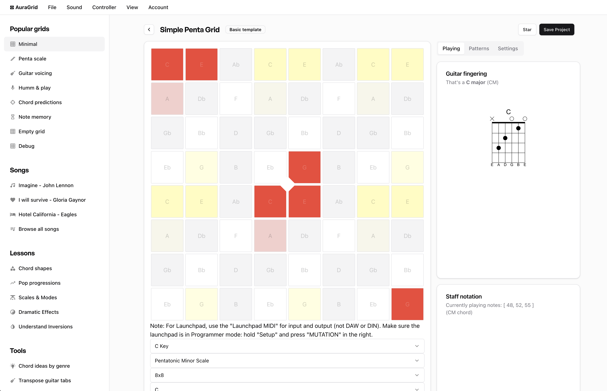

# Aura Grid

 
This is an issues-only repo for [Aura](https://aura.town)'s [Grid app](https://app.aura.town).

Creating new tickets for bugs or feature requests is much appreciated 🙂 Feel free to react to the ones you'd like us to prioritize. Our goal is to make Aura work great for you, and your feedback is super helpful.

## Getting Started

Head over to [our website](https://aura.town) to learn about our plans and how to use with your midi controller configs. The [AuraGrid app prototype](https://app.aura.town) is actively under developpement, and has lots of missing feature. Head over to  [ our Discord](https://discord.gg/kcrMkwxA9e) to talk with the team or get involved.

## Features

[See here](https://aura.town) for more info on Aura's features.

